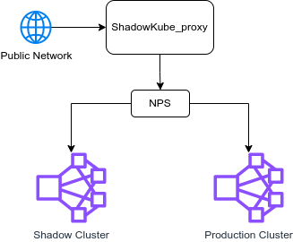

Shadow Proxy aims to redirect recorded malicious requests to shadow cluster, while others to normal cluster. Rules and redirect destinations are shown in `config.json`.

If the testing clusters locates in private network, tools like [nps](https://github.com/ehang-io/nps) who provides capability of intranet legacy are needed to integrate with the Shadow Proxy, for example:

 

`13389` port is used to listen signals to record attackers, while `log.json` will be created to record requests from public network.

How to run

```sh
RUST_LOG=debug cargo run .
```
